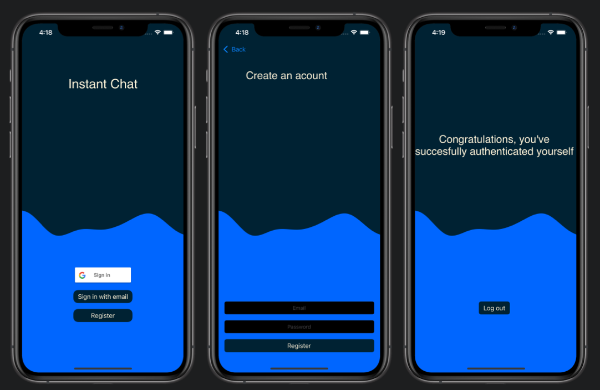

# Firebase Authentication in UIKit

This is my approach to create an app with authentication provided by Firebase. I used two methods of authentication the user. First is traditional one - with mail and password. The second one is with Google Account. To implement Firebase into the project I used CocoaPods.
 
 
 

### Assumptions:
1. Implement 2 ways of autentication.
2. Use CocoaPods to implement Firebase.
3. Do not really care about the file structure.
 

### How to install
1. Make sure you have installed CocoaPods on your machine (in terminal --> sudo gem install cocoapods).
2. Clone this repo to Xcode.
3. Inside terminal change directory to the one with project.
4. Inside terminal execute this command --> pod install.
5. Choose the simulator.
6. Hit the run button.
 
 
 

### Screenshots

 
 
 
